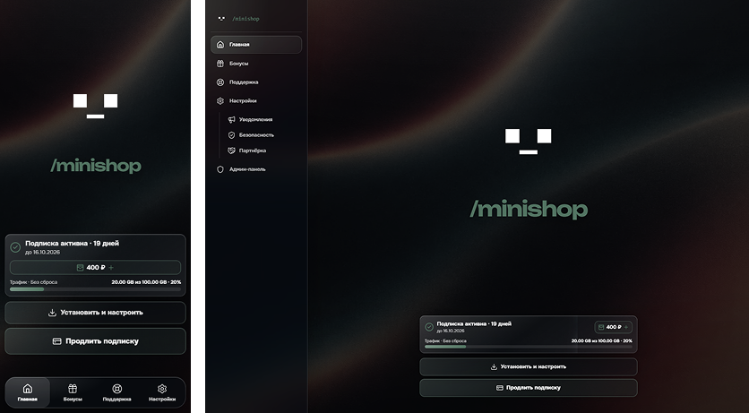
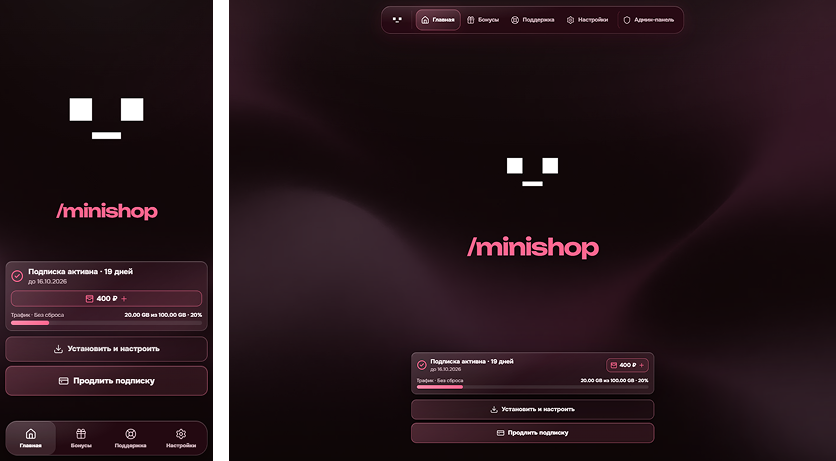

# Liquid Glass themes for Remnawave Minishop

Набор кастомных тем для **Remnawave Minishop** на Theme API 1.

Обе темы сохраняют стандартную структуру и функциональность Minishop, но меняют визуальный слой: фон, стеклянные поверхности, навигацию, карточки, формы, модальные окна и административный интерфейс.

## Liquid Glass

Основная тёмная тема с холодной зелёной палитрой.

- полупрозрачные glass-поверхности;
- зелёный акцент;
- адаптация пользовательского и административного интерфейса;
- стандартный левый desktop rail;
- нижняя навигация на мобильных устройствах;
- оптимизация backdrop blur для Telegram / Android WebView;
- локальные шрифты Onest и Unbounded;
- адаптивный фон с лёгким parallax-эффектом.



Папка темы: [`liquid/`](./liquid/)

## Liquid Glass — Pink

Альтернативная версия Liquid Glass в тёмной бордово-розовой палитре.

- pink / burgundy палитра и отдельный фон;
- те же glass-компоненты и эффекты, что в основной теме;
- на desktop пользовательская навигация перенесена в компактный плавающий top bar;
- административная панель сохраняет отдельный sidebar;
- мобильная навигация остаётся нижней;
- HomeScreen адаптирован под высоту viewport без лишней вертикальной прокрутки.



Папка темы: [`liquid-pink/`](./liquid-pink/)

## Структура

```text
.
├── liquid/
├── liquid-pink/
├── minishop-themes.json
├── preview-green.png
└── preview-pink.png
```

Каждая тема содержит собственные `theme.json`, `theme.css`, `theme-package.json`, preview, фон и локальные assets.
